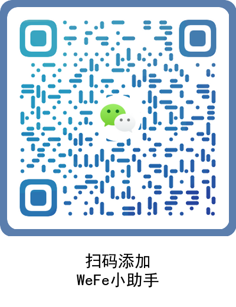

# Fusion（数据融合工具系统）

fusion是一款基于ECDH（Elliptic Curve Diffie-Hellman）和RSA（Rivest-Shamir-Adleman）两种算法的数据融合工具系统。fusion系统的目标是为了解决数据融合过程中的数据隐私保护问题，保护数据的隐私性，同时保证数据融合的准确性。

**项目特点**
1. **简化传输**: 工具采用https端口进行数据传输，双方交互只需要一个端口即可完成，无需复杂的网络配置，提高了传输的效率和安全性。
2. **简单操作界面**: 工具的界面操作更加简单直观，任务进度可视化，用户无需额外管理数据集、合作方等信息，轻松完成数据融合任务。
3. **灵活的配置功能**: 灵活选择主键，主键加密算法，可额外配置结果集的输出字段，满足不同的数据融合需求。
4. **自动创建数据库**: 程序自动创建的sqlite数据库免去了用户繁琐的配置和安装步骤，使得数据融合过程更加简便高效。
5. **内置UI界面**: 工具支持将UI界面内置到jar包中，用户无需额外安装，直接运行jar包即可轻松使用，降低了使用门槛，提高了用户的便捷性。

## 安装部署
详见 [安装部署](./docs/install.md).

## 使用教程
详见 [使用教程](./docs/fusion.md).

# 版权

Apache 2.0

# 联系我们

欢迎扫码添加 WeFe 小助手（微信号：tianmiantech001）；

  

添加后滴滴小助手，小助手会拉你进 WeFe 技术交流群哦~；

欢迎关注天冕科技公众号

  

快来寻找志同道合的伙伴吧！
