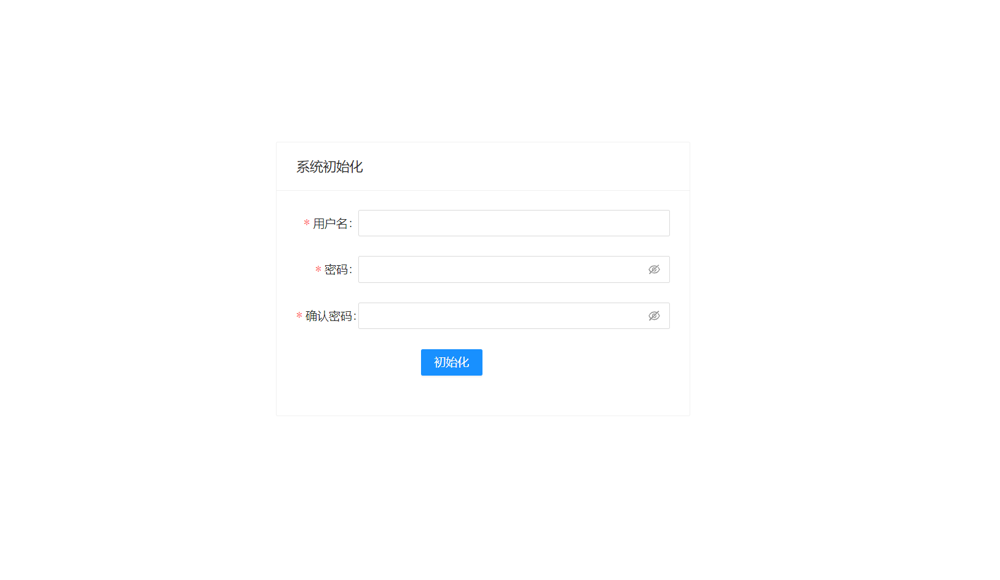
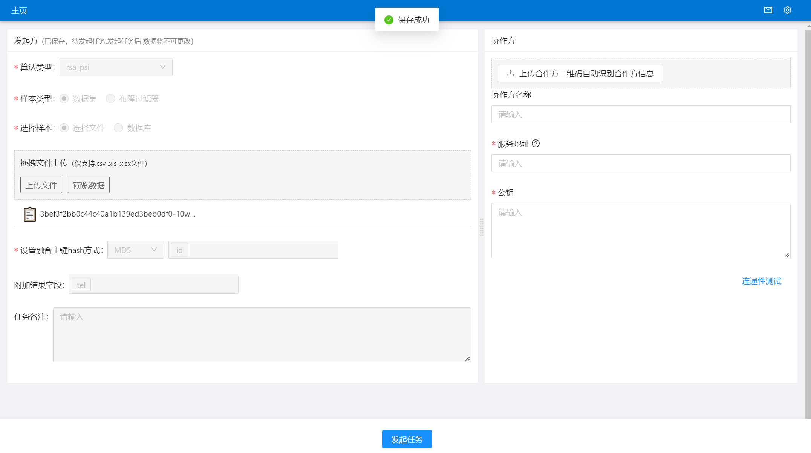

## 功能介绍
### 注册登录

首次登录系统时需要注册，输入用户名和密码，点击**注册**，成功进入系统首页。

已注册的使用账户名和密码即可登录系统。

### 首页

进入系统首页展示如下图：

1. 中部展示**发起任务**按钮；
2. 右侧导航栏展示系统提醒消息页面，点击可查看待处理任务；
3. 设置按钮展示系统全局配置信息。

### 全局配置
进入首页后，点击右上角的**设置**按钮配置对外服务地址，用于与合作方通信：

配置后，点击**连通性测试**，并**保存**，自动生成配置二维码，可拍照或保存发送给合作方，合作方上传二维码识别合作方信息，向我方发送任务。

### 发起任务
用户进入系统首页后可发起数据融合任务：

1. 点击**发起任务**按钮，跳转任务创建页面，上传发起方数据资源，设置融合主键及其加密方式；

- 算法类型下拉选择，支持RSA（Rivest-Shamir-Adleman）及ECDH（Elliptic Curve Diffie-Hellman）两种数据融合方案。
- 样本类型支持数据集文件及过滤器文件。
- 样本来源支持文件 *（csv，xls，xlsx)* 上传及数据库上传，数据库类型支持 *Mysql，Doris，Hive*。
- 设置融合主键hash方式，支持*md5*和*sha256*两种hash方式对主键进行加密。
- 添加附加字段，融合结果除返回融合主键外，新增融合结果的返回字段。 

使用数据集上传样本如下：

选择文件上传，扫描完成后可设置融合主键hash方式，支持*md5*和*sha256*两种hash方式对主键进行加密。

使用过滤器文件上传如下：

样本类型选择布隆过滤器，点击**选择布隆过滤器**,选择过滤器文件，自动关联主键及其加密方式:

> 这里的过滤器文件来源于当前成员在历史合作融合任务自动生成的过滤器，当两方进行数据融合时，由样本量较大的那一方自动生成过滤器文件。

选择数据库上传样本如下：

样本上传完成后并设置融合组件及其加密方式后，点击**保存**按钮。

2. 配置协作方信息

用户填写合作方配置信息后，点击**连通性测试**测试通过后，可发起融合任务。

填写合作方配置有两种方式：
- 用户通过上传合作方二维码识别合作方配置信息，上传二维码后，点击**识别二维码**按钮，合作方服务信息及公钥自动填充；

- 用户手动填写合作方配置信息，如协作方名，可自定义；协作方服务地址及公钥，由合作方提供后填写。

3. 发起任务
发起方及协作方信息都填写完成后，点击**发起任务**按钮，创建融合任务，创建成功后等待合作方进行任务审核，发起成功后主页展示任务列表。

任务列表如下，状态为审批中。

### 任务审核
发起方发起任务成功后，合作方会收到一条待处理任务，展示在任务列表；右上角小红点消息提醒，点击显示待处理任务。

点击主页-列表-**去审批**或消息提醒-待处理任务-**去审批**按钮，进行任务审核。
若合作方**拒绝**，则该任务流程终止，需发起方重新创建任务；若合作方审核通过，需上传数据集并选择融合主键以及主键加密方式，填写完成后，点击**通过并开启任务**按钮，开启数据融合任务。

> 注意：合作方主键加密方式需一致。

### 任务执行
合作方审核任务通过后，任务开始执行，主页展示任务列表，状态为运行中；

点击详情可见任务信息，多方详情及任务进度。

### 查看融合结果
任务执行成功后，在任务详情页，可预览结果，展示融合字段及附加字段，该预览功能只展示部分融合结果：

点击下载结果将融合结果下载为csv文件查看。
