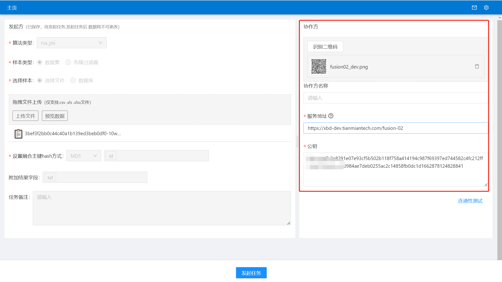

# fusion

数据融合工具系统

**相比之前 fusion 的主要区别：**

- 无额外的 socket 端口，传输文件使用 http 端口。
- 使用程序自动创建的 sqlite 数据库，免配置，免安装。
- 无数据集管理功能，数据不再抽取到 fusion 系统中，而是执行任务时从数据源即时读取。
- 前端内置在 jar 包中
- 支持 ecdh 和 rsa-bloom-filter 两种算法
- 创建任务时允许双方都选择数据集，程序自动选择数据量大的一方生成过滤器后执行任务。
- 回溯功能不再限制为时间字段，可以选择任意字段，且参与双方都能选择。

## 产品介绍

xxxxxx

## 功能介绍

### 注册登录

首次登录系统时需要注册，输入用户名和密码，点击**注册**，成功进入系统首页。

已注册的使用账户名和密码即可登录系统。

### 首页

进入系统首页展示如下图：

1. 中部展示**发起任务**按钮；
2. 右侧导航栏展示系统提醒消息页面，点击可查看待处理任务；
3. 设置按钮展示系统全局配置信息。

### 全局配置
进入首页后，点击右上角的**设置**按钮配置对外服务地址，用于与合作方通信：

配置后，点击**连通性测试**，并**保存**，自动生成配置二维码，可拍照或保存发送给合作方，合作方上传二维码识别合作方信息，向我方发送任务。

### 发起任务
用户进入系统首页后可发起数据融合任务：

1. 点击**发起任务**按钮，跳转任务创建页面，上传发起方数据集，设置融合主键及其加密方式；

- 算法类型下拉选择，支持RSA（Rivest-Shamir-Adleman）及ECDH（Elliptic Curve Diffie-Hellman）两种数据融合方案。
- 样本类型支持数据集文件及过滤器文件。
- 样本来源支持文件 *（csv，xls，xlsx)* 上传及数据库上传，数据库类型支持 *Mysql，Doris，Hive*。
- 设置融合主键hash方式，支持*md5*和*sha256*两种hash方式对主键进行加密。
- 添加附加字段，融合结果除返回融合主键外，新增融合结果的返回字段。

2. 配置协作方信息
用户填写合作方配置信息后，点击**连通性测试**测试通过后，可发起融合任务。

填写合作方配置 有两种方式：
- 用户通过上传合作方二维码识别合作方配置信息，上传二维码后，点击**识别二维码**按钮，合作方服务信息及公钥自动填充；

- 用户手动填写合作方配置信息，如协作方名，可自定义；协作方服务地址及公钥，由合作方提供后填写。

3. 发起任务
发起方及协作方信息都填写完成后，点击**发起任务**按钮，创建融合任务，创建成功后等待合作方进行任务审核。发起成功后主页展示任务列表。

任务列表如下，状态为审批中。

### 任务审核
发起方发起任务成功后，合作方会收到一条待处理任务，展示在任务列表；右上角小红点消息提醒，点击显示待处理任务。

点击主页-列表-**去审批**或消息提醒-待处理任务-**去审批**按钮，进行任务审核。
若合作方**拒绝**，则该任务流程终止，需发起方重新创建任务；若合作方审核通过，需上传数据集并选择融合主键以及主键加密方式，填写完成后，点击**通过并开启任务**按钮，开启数据融合任务。

> 注意：合作方主键加密方式需一致。

### 任务创建

### 查看融合结果